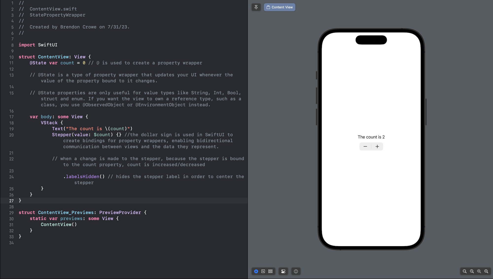

# Data flow using @State

With UIKit, it’s up to you to update your UI when data changes. For example, whenever you increase or decrease a number property with a stepper, you want a label to reflect that change. Ensuring this happens isn’t difficult, but it’s easy to forget something when your app grows with new features. In addition to keeping the UI data up to date, you might need to show a loading spinner while the view loads. If the movie list is empty, you can show a message to prompt the user to add something. If there’s an error, you can hide everything else and show an error message. You have to do this every time your data changes.

In place of the imperative approach, SwiftUI adopts a declarative programming style that makes updating your UI a breeze. Rather than focusing on how to update the UI, you focus on what to update. SwiftUI’s data flow handles the rest. Every time your data changes, SwiftUI rebuilds any views depending on that data from scratch according to the latest data. This means there’s no risk of displaying a loading spinner, a table of results and an error message all at once.

## Example


### Code
``` Swift
import SwiftUI

struct ContentView: View {
    @State var count = 0 // @ is used to create a property wrapper
    
    // @State is a type of property wrapper that updates your UI whenever the value of the property bound to it changes.
    
    // @State properties are only useful for value types like String, Int, Bool, struct and enum. If you want the view to own a reference type, such as a class, you use @ObservedObject or @EnvironmentObject instead.
    
    var body: some View {
        VStack {
            Text("The count is \(count)")
            Stepper(value: $count) {} //the dollar sign is used in SwiftUI to create bindings for property wrappers, enabling bidirectional communication between views and the data they represent.
            
            // when a change is made to the stepper, because the stepper is bound to the count property, count is increased/decreased
            
                .labelsHidden() // hides the stepper label in order to center the stepper
        }
    }
}

struct ContentView_Previews: PreviewProvider {
    static var previews: some View {
        ContentView()
    }
}
```

## Example illustrated in UIKit
```Swift
import UIKit

class ViewController: UIViewController {
    
    lazy var label: UILabel = {
        let label = UILabel()
        label.translatesAutoresizingMaskIntoConstraints = false
        label.text = "The count is \(count)"
        label.font = UIFont.preferredFont(forTextStyle: .body)
        return label
    }()
    
    lazy var stepper: UIStepper = {
        let stepper = UIStepper()
        stepper.center = view.center
        stepper.minimumValue = -100
        stepper.maximumValue = 100
        stepper.stepValue = 1
        return stepper
    }()
    
    var count = 0 {
        didSet {
            label.text = "The count is \(count)"
        }
    }
    
    override func viewDidLoad() {
        super.viewDidLoad()
        configureUI()
        stepper.addTarget(self, action: #selector(changeValue), for: .valueChanged)
    }
    
    @objc
    func changeValue() {
        count = Int(stepper.value)
    }
    
    func configureUI() {
        view.addSubview(stepper)
        view.addSubview(label)
        NSLayoutConstraint.activate([
            label.bottomAnchor.constraint(equalTo: stepper.topAnchor, constant: -8),
            label.centerXAnchor.constraint(equalTo: view.centerXAnchor),
            stepper.centerXAnchor.constraint(equalTo: view.centerXAnchor),
            stepper.centerYAnchor.constraint(equalTo: view.centerYAnchor)
        ])
    }
}
```
